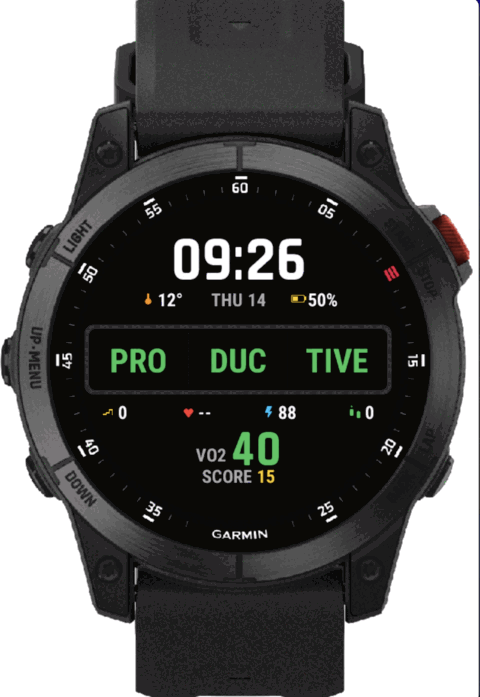

# TrainingStatusSlot

A playful Garmin Connect IQ watch face that turns your training status into a slot machine.

Every wake spins three reels of training-status syllables (`PRO` `DUC` `TIVE`, `OVER` `REACH` `ING`, …). Most spins are random — but every 7th wake the reels land on your real current training status pulled from Garmin's complication API. Land on a real word and you score points. Watch the score tick up.

Built for AMOLED Garmin watches (epix2, fenix7/8, FR955/965, venu3). MIP devices are supported but the dim grey frame palette was tuned for AMOLED contrast.

## Features

- **Slot reels** with smooth easing animation, staggered column stops, and configurable spin physics.
- **Real training status reveal** every 7th wake — reads `Complications.COMPLICATION_TYPE_TRAINING_STATUS` and forces all three reels to land on it. Falls back to a "keep spinning" state if the watch hasn't computed a status yet.
- **Scoring**:
  - **10 points** when all three reels spell a real status word (e.g. `PRODUCTIVE`, `OVERREACHING`).
  - **5 points** for readable partials — `PEAK`, `MAINTAIN`, `OVERREACH`, `STRAIN`, `PRODUC`, `UNPRODUC`, `DETRAIN` (prefixes) and `TRAINING`, `REACHING`, `STATUS` (suffixes).
  - Persists across reboots via `Application.Storage`.
- **Status-colored highlights** — when reels spell a real word, the matching segments turn the brand color of that training status (green for Productive, deep orange for Overreaching, purple for Detraining, etc.).
- **Bias** — random spins have a ~33% chance of being "loaded" to land all three reels on the same status, so 10-pointers happen often enough to feel rewarding.
- **Surrounding metrics** drawn with hand-rolled vector icons (no asset pipeline):
  - Top row: temperature, date, battery (with proportional fill).
  - Bottom row: floors climbed, heart rate, body battery, steps.
  - Sunset time computed from the weather observation location.
  - **VO2 max** in large type, colored by Garmin's fitness-level bands (Poor / Fair / Good / Excellent / Superior) based on user age and sex from `UserProfile`.

## Screenshots

<p align="center">
  
</p>

A 10-point "PRODUCTIVE" reveal — all three reels land on the same status, segments turn green (PRODUCTIVE's color), and the score jumps by 10.

## Installation

### Sideload (USB)

1. Plug your watch into your Mac via USB. Press any button on the watch to wake it into Mass Storage mode (macOS doesn't speak MTP).
2. Build:
   ```bash
   ./scripts/build.sh
   ```
3. Copy the `.prg` for your device:
   ```bash
   cp bin/trainingstatusslot.prg "/Volumes/GARMIN/GARMIN/APPS/"
   ```
4. Eject the volume in Finder, unplug the watch. The face appears under **Watch Face → Connect IQ**.

### Connect IQ Store

The release `.iq` package can be uploaded to <https://apps.garmin.com/developer/dashboard> as a private/hidden app. See [Garmin's docs](https://developer.garmin.com/connect-iq/connect-iq-faq/how-do-i-publish-an-app-to-the-connect-iq-store/) for the submission flow.

## Screenshot pipeline

Multi-device gallery generation is automated. With the simulator installed:

```bash
# Grant Terminal "Accessibility" permission once
# (System Settings → Privacy & Security → Accessibility → enable Terminal).

CIQ_KEY=~/garmin_dev_key.der ./scripts/screenshots.sh                    # all manifest devices
CIQ_KEY=~/garmin_dev_key.der ./scripts/screenshots.sh epix2 venu3 fr165  # subset
```

Writes one PNG per device to `docs/screenshots/` and regenerates `docs/screenshots/INDEX.md`. See [`docs/IMPLEMENTATION_PLAN.md`](docs/IMPLEMENTATION_PLAN.md) for the broader testing strategy.

## Building

Requirements:
- [Garmin Connect IQ SDK](https://developer.garmin.com/connect-iq/sdk/) (tested with 9.1.0).
- A developer key (`.der`). Generate with `openssl genrsa | openssl pkcs8 -topk8 -outform DER -nocrypt -out developer_key.der`.

Build the debug `.prg` for the epix2 simulator:
```bash
SDK="$HOME/Library/Application Support/Garmin/ConnectIQ/Sdks/connectiq-sdk-mac-9.1.0-2026-03-09-6a872a80b"
"$SDK/bin/monkeyc" -d epix2 -f monkey.jungle -o bin/trainingstatusslot.prg -y ~/developer_key.der
```

Build the multi-device release `.iq`:
```bash
"$SDK/bin/monkeyc" -e -f monkey.jungle -o bin/trainingstatusslot.iq -y ~/developer_key.der --release
```

Run in the simulator:
```bash
"$SDK/bin/connectiq" &
"$SDK/bin/monkeydo" bin/trainingstatusslot.prg epix2
```

## Project structure

```
source/
  BanditApp.mc            AppBase entry point.
  BanditView.mc           WatchFace — layout, spin animation, scoring, rendering.
  Icons.mc                Vector icon drawing (heart, footprints, bolt, sun, thermometer, battery, …).
  TrainingStatusProvider.mc  Complication reader + per-status colors + readable-partial whitelist.
  VO2MaxProvider.mc       VO2 max complication + Garmin's age/sex-banded fitness classification.

resources/
  drawables/              Launcher icon.
  strings/                User-facing strings.

manifest.xml              Connect IQ manifest. Declares app ID, supported devices, permissions.
monkey.jungle             Build descriptor.
```

## Permissions

- `ComplicationSubscriber` — read training status and VO2 max.
- `SensorHistory` — body battery latest sample.
- `UserProfile` — age and sex for VO2 max fitness band classification.

## Customization

Common tweaks live as constants at the top of `BanditView.mc`:

| Constant | Effect |
|---|---|
| `FRAME_MS` | Animation framerate (default ~30fps). |
| `ROW_HEIGHT` | Vertical size of each reel cell. Bumps the slot height. |
| `SPIN_BASE_MS`, `SPIN_STAGGER_MS` | First-column stop time, gap between column stops. |
| `FULL_ROTATIONS` | How many full strip rotations before landing. |
| `(Math.rand() % 100) < 33` | Probability that a random spin is "loaded" with a forced match. |
| `((count as Number) % 7) == 0` | How often the real training status is revealed (every Nth wake). |

The status color palette lives in `TrainingStatusProvider.colorFor()`. The readable-partial whitelist (which 2-segment combos count toward a 5-point score) lives in `TrainingStatusProvider.hasReadablePrefix/Suffix`.

## Supported devices

All variants declared in `manifest.xml`:

epix2 · epix2pro (42 / 47 / 51 mm) · fenix7 · fenix7pro · fenix7s · fenix7spro · fenix7x · fenix7xpro · fenix8solar (47 / 51 mm) · fr955 · fr965 · venu3 · venu3s

## License

MIT — see [LICENSE](LICENSE).
